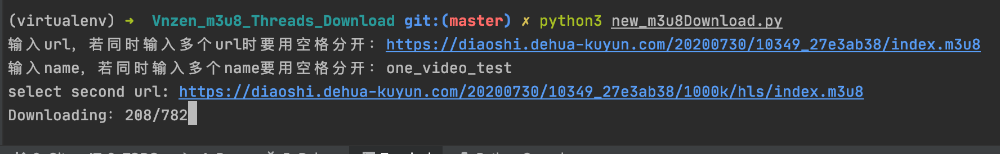
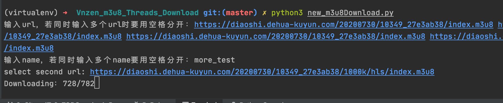
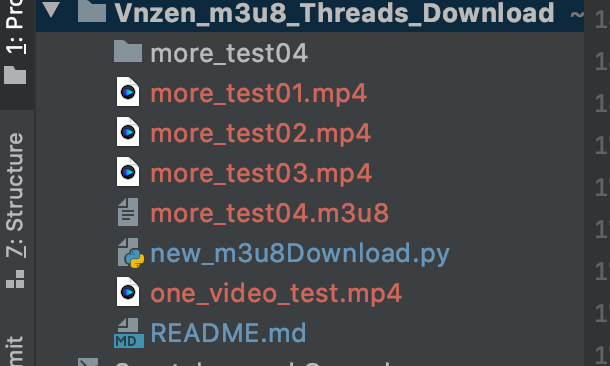

## HELLO
    我想要🌟🌟，你可以给我点亮它吗

## 用处

1. 支持`m3u8`类型流媒体，能播放就能下载
2. 多线程下载
3. 批量任务、一次性下载一部电视剧都没问题  

## 依赖

1. `python3.6+`  
2. `requests`库,使用`pip install requests`安装  
3. [ffmpeg](http://www.ffmpeg.org)，对于Windows用户，需要将ffmpeg添加进环境变量中,直到你可以在CMD中使用ffmpeg命令   
    termux: `pkg install ffmpeg`  
    centos: `yum install ffmpeg`  
    mac os: `brew install ffmpeg`  

## 使用

1. 输入 `完整的m3u8文件链接: url`、`保存m3u8的文件名: name`即可使用  
  
  
  
